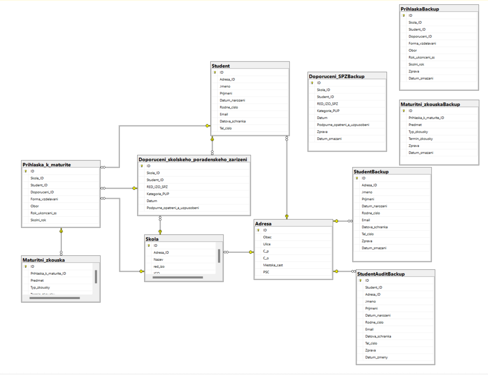

# Praktická maturitní zkouška

**Střední průmyslová škola elektrotechnická, Praha 2, Ječná 30**
**Školní rok 2023/2024**
---
Jméno a příjimeni: Maksym Kintor  
Třída: C4b
---

## Úvod
Téma: Školství/vzdělání  
Typ: Dokument  
Moje volba: Maturitní přihláška  

Dokumenty pužité jako zdroj:  
- `doc/documents/Maturitni_prihlaska.pdf`
- `doc/documents/Uzpusobeni_podminek_formular.pdf`

## Struktura složek
<pre>
|___README.md (tento soubor)
|___README.pdf
|___analyza.md
|___analyza.pdf
|___doc/
    |___config/
        |___dictionary.txt
        |___Users.txt
    |___documents/
        |___Maturitni_prihlaska.pdf
        |___Uzpusobeni_podminek_formular.pdf
        |___Full_Backup.bak
    |___img/
        |___diagram.png
    |___sql/
        |___Export_Structure_Trigger_Index.sql
        |___Export_Test_Data.sql
        |___Export_Users.sql
        |___Export_View_Procedure.sql
        |___procedure.sql
        |___script.sql
        |___testdata.sql
        |___trigger.sql
        |___view.sql

</pre>

## E-R model
Relační model databáze se nachází v `/doc/img/diagram.png`

## Entitní integrita
Každá entita obsahuje uměle vytvořený primární klíč, označený jako `ID`, 
který se s každým dalším záznamem inkrementuje.  
`ID int primary key identity(1,1);`

## Doménová integrita
> **Student**  
> - ID **int primary key**
> - Adresa_ID **int foreing key references Adresa(ID) not null**
> - Jmeno **varchar(64) not null check(len(Jmeno) >= 2)**
> - Prijmeni **varchar(64) not null check(len(Prijmeni) >= 2)**
> - Datum_narozeni **date not null**
> - Rodne_cislo **varchar(15) check(Rodne_cislo like '[0-9][0-9][0-9][0-9][0-9][0-9]/[0-9][0-9][0-9][0-9]')**, může být v formátu 6 čísel/4 čísla
> - Email **varchar(100) check(Email like '%@%.%')**, formát XXXX@XXX.XXX, neberu do ohledu existenci gmail, seznam a další, předpokládejme správný vstup dat
> - Datova_schranka **varchar(64) check(len(Datova_schranka) > 3)**
> - Tel_cislo **varchar(16) check(Tel_cislo LIKE '+420[0-9][0-9][0-9][0-9][0-9][0-9][0-9][0-9]' OR Tel_cislo LIKE '+420 [0-9][0-9][0-9] [0-9][0-9][0-9] [0-9][0-9][0-9]' OR Tel_cislo LIKE '[0-9][0-9][0-9] [0-9][0-9][0-9] [0-9][0-9][0-9]' OR Tel_cislo LIKE '[0-9][0-9][0-9][0-9][0-9][0-9][0-9][0-9]')**, možné formáty jsou [+420 123 456 789],[+420123456789], [123 456 789], [123456789]

> **StudentBackup**
> -	ID **int primary key** 
> - Adresa_ID **int foreing key references Adresa(ID) not null**
> - Jmeno **varchar(64) not null check(len(Jmeno) >= 2)**
> - Prijmeni **varchar(64) not null check(len(Prijmeni) >= 2)**
> - Datum_narozeni **date not null**
> - Rodne_cislo **varchar(15) check(Rodne_cislo like '[0-9][0-9][0-9][0-9][0-9][0-9]/[0-9][0-9][0-9][0-9]')**, může být v formátu 6 čísel/4 čísla
> - Email **varchar(100) check(Email like '%@%.%')**, formát XXXX@XXX.XXX, neberu do ohledu existenci gmail, seznam a další, předpokládejme správný vstup dat
> - Datova_schranka **varchar(64) check(len(Datova_schranka) > 3)**
> - Tel_cislo **varchar(16) check(Tel_cislo LIKE '+420[0-9][0-9][0-9][0-9][0-9][0-9][0-9][0-9]' OR Tel_cislo LIKE '+420 [0-9][0-9][0-9] [0-9][0-9][0-9] [0-9][0-9][0-9]' OR Tel_cislo LIKE '[0-9][0-9][0-9] [0-9][0-9][0-9] [0-9][0-9][0-9]' OR Tel_cislo LIKE '[0-9][0-9][0-9][0-9][0-9][0-9][0-9][0-9]')**, možné formáty jsou [+420 123 456 789],[+420123456789], [123 456 789], [123456789]
> -	Zprava **varchar(64) not null**
> -	Datum_smazani **date not null**

>**StudentAuditBackup**
> -	ID **int primary key**
> -	Student_ID **int foreign key references Student(ID) not null**
> - Adresa_ID **int foreing key references Adresa(ID) not null**
> - Jmeno **varchar(64) not null check(len(Jmeno) >= 2)**
> - Prijmeni **varchar(64) not null check(len(Prijmeni) >= 2)**
> - Datum_narozeni **date not null**
> - Rodne_cislo **varchar(15) check(Rodne_cislo like '[0-9][0-9][0-9][0-9][0-9][0-9]/[0-9][0-9][0-9][0-9]')**, může být v formátu 6 čísel/4 čísla
> - Email **varchar(100) check(Email like '%@%.%')**, formát XXXX@XXX.XXX, neberu do ohledu existenci gmail, seznam a další, předpokládejme správný vstup dat
> - Datova_schranka **varchar(64) check(len(Datova_schranka) > 3)**
> - Tel_cislo **varchar(16) check(Tel_cislo LIKE '+420[0-9][0-9][0-9][0-9][0-9][0-9][0-9][0-9]' OR Tel_cislo LIKE '+420 [0-9][0-9][0-9] [0-9][0-9][0-9] [0-9][0-9][0-9]' OR Tel_cislo LIKE '[0-9][0-9][0-9] [0-9][0-9][0-9] [0-9][0-9][0-9]' OR Tel_cislo LIKE '[0-9][0-9][0-9][0-9][0-9][0-9][0-9][0-9]')**, možné formáty jsou [+420 123 456 789],[+420123456789], [123 456 789], [123456789]
> -	Zprava **varchar(64) not null**
> -	Datum_zmeny **date not null**

> **PrihlaskaBackup**
> - ID **int primary key**
> - Skola_ID **int not null**
> - Student_ID **int not null**
> - Doporuceni_ID **int**
> - Forma_vzdelavani **int not null**
> - Obor **int not null**
> - Rok_ukonceni_ss **int not null check(Rok_ukonceni_ss >= 2000)**
> - Skolni_rok **int not null**
> - Zprava **varchar(64) not null**
> - Datum_smazani **date not null**

> **Maturitni_zkouskaBackup**
> - ID **int primary key**
> - Prihlaska_k_maturite_ID **int not null**
> - Predmet **int not null**
> - Typ_zkousky **int not null**
> - Termin_zkousky **int not null**
> - Zprava **varchar(64) not null**
> - Datum_smazani **date not null**

> **Doporuceni_SPZBackup**
> - ID **int primary key**
> - Skola_ID **int not null**
> - Student_ID **int not null**
> - RED_IZO_SPZ **int not null**
> - Kategorie_PUP **int not null**
> - Datum **date not null**
> - Podpurne_opatreni_a_uzpusobeni **varchar(600) not null**
> - Zprava **varchar(64) not null**
> - Datum_smazani **date not null**
  
> **Adresa**
> - ID **int primary key**
> - Obec **varchar(64) not null check(len(Obec) > 2)**
> - Ulice **varchar(64) not null check(len(Ulice) > 2)**
> - C_p **int not null check(C_p >= 0)**
> - C_o **int not null check(C_o >= 0)**
> - Mestska_cast **varchar(64) not null check(len(Mestska_cast) > 2)**
> - PSC **int not null check(PSC >= 0)**

> **Skola**
> - ID **ini primary key**
> - Adresa_ID **int foreign key references Adresa(ID) not null**
> - Nazev **varchar(100) not null check(len(Nazev) > 10)**
> - red_izo **int not null unique**
> - ICO **int not null unique**

> **Prihlaska_k_maturite**
> - ID **int**
> - Skola_ID **int foreign key references Skola(ID) not null**
> - Student_ID **int foreign key references Student(ID) not null**
> - Doporuceni_ID **int foreing key references Doporuceni_skolskeho_poradenskeho_zarizeni(ID)**
> - Forma_vzdelavani **int not null**
> - Obor **int not null**
> - Rok_ukonceni_ss **int not null check(Rok_ukonceni_ss >= 2000)**, omezíme se na dnešní tisíceletí
> - Skolni_rok **int not null**

> **Doporuceni_skolskeho_poradenskeho_zarizeni**
> - ID **int primary key** 
> - Skola_ID **int foreign key references Skola(ID) not null**
> - Student_ID **int foreign key references Student(ID) not null**
> - RED_IZO_SPZ **int not null**, může být FK odkazovat na ŠPZ, ale pro účely toho zadání to není relevantní
> - Kategorie_PUP **int not null**
> - Datum **date not null**
> - Podpurne_opatreni_a_uzpusobeni **varchar(600) not null**

> **Maturitni_zkouska**
> - ID **int primary key**
> - Prihlaska_k_maturite_ID **int foreign key references Prihlaska_k_maturite(ID) not null**
> - Predmet **int not null**
> - Typ_zkousky **int not null**
> - Termin_zkousky **int not null**

## Referenční integrita
- FK__Skola__Adresa_ID__ Škola obsahuje FK na Adresu
- FK__Student__Adresa___ Student obsahuje FK na Adresu
- FK__Doporucen__Stude__ Doporučení ŠPZ obsahuje FK na Studenta
- FK__Prihlaska__Stude__ Přihláška k maturitě obsahuje FK na Studenta
- FK__Doporucen__Skola__ Doporučení ŠPZ obsahuje FK na Školu
- FK__Prihlaska__Skola__ Přihláška k maturitě obsahuje FK na Školu
- FK__Prihlaska__Dopor__ Přihláška k maturitě obsahuje FK na Doporučení ŠPZ
- FK__Maturitni__Prihl__ Maturitní zkouška obsahuje FK na Přihlašku k maturitě

## Indexy 
- Databáze obsahuje umělé vytvořené indexy, za účelem zachování null a unique na některých atributech
> **Hodnota může být NULL, ale když není NULL tak musí být UNIQUE**
> - IX_Student_Rodne_cislo_notnull  
    ON Student(Rodne_cislo) WHERE Rodne_cislo IS NOT NULL;  
> - IX_Student_Email_notnull  
    ON Student(Email) WHERE Email IS NOT NULL;
> - IX_Student_Datova_schranka_notnull  
    ON Student(Datova_schranka) WHERE Datova_schranka IS NOT NULL;
> - IX_Student_Tel_cislo_notnull  
    ON Student(Tel_cislo) WHERE Tel_cislo IS NOT NULL;

- Další indexy jsou na FK atributech tabulek, aby bylo rychlejší vyhledávání podle reference (viz Oracle Academy DP 16-2: Indexes and Synonyms)
> - IX_Student_Adresa attribute **`Adresa_ID`**
> - IX_Skola_Adresa attribute **`Adresa_ID`**
> - IX_Dop_SPZ_Student attribute **`Student_ID`**;
> - IX_Dop_SPZ_Skola attribute **`Skola_ID`**;
> - IX_Maturitni_Zkouska_Prihlaska attribute **`Prihlaska_k_maturite_ID`**;
> - IX_Prihlaska_Skola attribute **`Skola_ID`**;
> - IX_Prihlaska_Student attribute **`Student_ID`**;

## Pohledy

- **Studenty_zkousky** - vypisuje všechny studenty a všechny zkoušky přiřazené k ním. Jedná se o celkový výpis všech ze všeho období co databáze funguje.  
    Příklad výpisu:  
    `Jméno`: Maksym   
    `Příjmení`: Kintor   
    `Datum narození`: 2005-04-29   
    `Název školy`: Strední prumyslová škola elektrotechnická   
    `Adresa`: Jecná 517/31  
    `Školní rok`: 2023/2024  
    `Předmět`: Ceský jazyk a literatura   
    `Typ zkoušky`: Povinná zkouška  
    `Termín zkoušky`: Rádný termín   

- **Doporuceni_studenty** - vypisuje všechny studenty a všechny jejich doporučení od ŠPZ. Jedná se o celkový výpis všech ze všeho období co databáze funguje.  
    Příklad výpisu:  
    `Jméno`: Maksym  
    `Příjemní`: Kintor  
    `Datum narození`: 2005-04-29  
    `Název školy`: Strední prumyslová škola elektrotechnická  
    `Adresa`: Jecná 517/31  
    `Školní rok`: 2023/2024  
    `RED_IZO_SPZ`: 123456  
    `Kategorie PUP`: TP  
    `Datum`: 2023-12-26  
    `Informace`: Student má nějaké problémy  

- **Studenty_prihlasky** - vypisuje všechny studenty a všechny jejich přihlášky. Jedná se o celkový výpis všech ze všeho období co databáze funguje.  
    Příklad výpisu:  
    `Jméno`: Maksym  
    `Příjemní`: Kintor  
    `Datum narození`: 2005-04-29  
    `Název školy`: Strední prumyslová škola elektrotechnická  
    `Adresa`: Jecná 517/31  
    `Školní rok`: 2023/2024   
    `Formá vzdělávání`: Denní  
    `Obor`: Informacní technologie 18-20-M/01  
    `Rok úspešného ukončení SŠ`: 2024

- **Studenty_vypis** - kompletní výpis všech studentů s jejich adresou.  
Příklad výpisu:  
    `Jméno`: Maksym    
    `Příjemní`: Kintor    
    `Datum narození`: 2005-04-29  
    `Obec`: Praha  
    `Ulice` Běhounkova 2305/9  
    `Městská část`: Praha 13-Stodůlky  
    `PSČ`: 15800

- **Skoly_vypis** - kompletní výpis všech škol a jejich adres.  
Příklad výpisu:  
    `Název`: Strední průmyslová škola elektrotechnická  
    `red_izo`: 600004783    
    `IČO`: 61385301  
    `Obec`: Praha  
    `Ulice` Jecná 517/31  
    `Městská část`: Praha 2-Nové Mesto  
    `PSČ`: 12000  

## Triggery
- **BackUpStudent** - je to instead of DELETE trigger. Při vymazání studenta, vymaže jeho přihlášky a doporučení (a jejich triggery je budou zálohovat také), zálohuje jeho data do `StudentBackUp` tabulky. Je to identická tabulka k tabulce Student, má navíc atributy:  
    - Zprava varchar(64) not null = `Concat('Smazal a zálohoval ',SUSER_NAME())`
	- Datum_smazani date not null = `GETDATE()`

- **AuditBackupStudent** - je to instead of UPDATE trigger. Pří změně údaju studenta, starou instanci zálohuje do tabulky `StudentAuditBackup`, což je identitcká tabulka k tabulce Student jenom obsahuje navíc:
    - ID int primary key identity(1,1) - vlastní PK
    - Student_ID int foreign key references Student(ID)
    - Zprava varchar(64) not null - `Concat('Hodnoty před změnami ',SUSER_NAME())`
    - Datum_zmeny date not null - `GETDATE()`

- **Backup_DoporuceniSPZ** - je to instead of DELETE trigger. Před vymazáním nastaví Doporuceni_ID na null u každé přihlášky, kde má svůj FK, a také zálohuje Doporučení do tabulky `Doporuceni_SPZBackup`, což je identická tabulka, má navíc atributy:  
    - Zprava varchar(64) not null = `Concat('Smazal a zálohoval ',SUSER_NAME())`
	- Datum_smazani date not null = `GETDATE()`

- **BackUpPrihlaska** - je to instead of DELETE trigger. Před smazáním, smaže všechny jeho maturitní zkoušky a potom zálohuje přihlášku do `PrihlaskaBackup`, což je identická tabulka, má navíc atributy:  
    - Zprava varchar(64) not null = `Concat('Smazal a zálohoval ',SUSER_NAME())`
	- Datum_smazani date not null = `GETDATE()`

- **BackUpZkouska** - je to after DELETE trigger. Před smazáním zálohuje maturitní zkoušku do `Maturitni_zkouskaBackup`, což je identická tabulka, má navíc atributy:  
    - Zprava varchar(64) not null = `Concat('Smazal a zálohoval ',SUSER_NAME())`
	- Datum_smazani date not null = `GETDATE()`

## Uložené procedury a funkce
- **Pridat_studenta** - přidáva studenta a jeho adresu do databáze. Zaroveň ohlídá duplicitu adres, je dost možné že všichni děti z jednoho paneláku budou maturovat, ušetřím místo v databázi a dám všem stejný FK Adresa_ID.  
>   **Parametry procedury**:   
> 	@Student_jmeno varchar(64)   
> 	@Student_prijmeni varchar(64)   
> 	@Datum_narozeni date   
> 	@Rodne_cislo varchar(15) = null  
> 	@Email varchar(100) = null  
> 	@Datova_schranka varchar(64) = null   
> 	@Tel_cislo varchar(16) = null  
> 	@Obec varchar(64)  
> 	@Ulice varchar(64)  
> 	@C_p int  
> 	@C_o int  
> 	@Mestska_cast varchar(64)  
> 	@PSC int
- **Pridat_skolu** - přidává školu a její adresu do databáze a zároveň ohlídá duplicitu adres jako v `Pridat_studenta`.    
>   **Parametry procedury**:   
>	@Nazev varchar(100)  
>	@red_izo int  
>	@ICO int  
>	@Obec varchar(64)  
>	@Ulice varchar(64)  
>	@C_p int  
>	@C_o int  
>	@Mestska_cast varchar(64)  
>	@PSC int
- **Pridat_Zkousku** - přidává zkoušku pro maturitní přihlášku. Vstupní parametry jsou textové a tyto následně přeloží pomocí CASE WHEN THEN podle `doc/config/dictionary.txt`    
>   **Parametry procedury**:   
>	@Prihlaska_k_maturite_ID int  
>	@Predmet varchar(64)  
>	@Typ_zkousky varchar(64)  
>	@Termin_zkousky varchar(64)    

## Přístupové údaje do databáze
Přístupove údaje se nacházi v `doc/config/users.txt`    
Jsou k dispozici:     
- manazer - může všechno vidět (select)
- sekretarka - může všechno vidět (select) a pracovat s daty podle DML příkazu (insert, update, delete)  
- administrator - je majitel celé databáze, má právo na všechno, vyžaduje znalosti práci s databázi  
- securityAdministrator - má na starosti DCL příkazy (grant, deny, revoke), může upravovat práva vašich zaměstnanců  
- developer - má na starosti DDL příkazy (create, alter, drop), vyžaduje znalosti z database designu  

## Import struktury databáze a dat od zadavatele
Před importem zajistětě jestli nemáte už vytvořenou databázi `MaturitniDatabaze`, když ano tak si ji zálohujte, protože táto databáze se vytvoří pod tímto jménem, tedy `MaturitniDatabaze`.
Jsou dva způsoby:
- Import podle exportu z databáze.
    - Musíte být příhlašen jako sysadmin celého serveru, jako root a spustit skripty v pořadí:
    - `doc/sql/Export_Structure_Trigger_Index.sql`, vytvoří čistou databázi `MaturitniDatabaze` a založí všechny entity, triggery a indexy.
    - `doc/sql/Export_View_Procedure.sql`, vytvoří všechny views a procedure k této databázi.
    - `doc/sql/Export_Test_Data.sql`, vytvoří všechny testovací data.
    - `doc/sql/Export_Users.sql`, vytvoří všechny logíny a usery k databázi.
    - Jakmile máte hotové všechny importy, můžete databázi spustit do ostrého provozu a předat uživatelské údaje svým zaměstnancům.
- Import podle mého ručně vytvořeného skriptu.
    - Musíte být příhlašen jako sysadmin celého serveru, jako root a spustit skripty v pořadí:
    - `doc/sql/script.sql`, vytvoří čistou databázi `MaturitniDatabaze` a založí všechny entity pracovní (backup entity jsou v triggerech) a indexy k ním.
    - `doc/sql/trigger.sql`, vytvoří všechny triggery a zálohovací entity.
    - `doc/sql/view.sql`, vytvoří všechny views.
    - `doc/sql/procedure.sql`, vytvoří všechny procedure.
    - `doc/sql/testdata.sql`, použije procedury na vytvoření testovacíh dat.
    - `doc/sql/Export_Users.sql`, vytvoří všechny logíny a usery k databázi.
    - Jakmile máte hotové všechny importy, můžete databázi spustit do ostrého provozu a předat uživatelské údaje svým zaměstnancům.

## Zálohování
Byl proveden inicializační Full backup viz `doc/documents/Full_Backup.bak`  
Differential backupy budou domluveny se zákázníkem. Základní zálohovací doba by mohla být jednou za týden, protože údaje o maturitních zkouškách jsou velmi důležité a my chceme mít tyto data bezpečně uložené.

## Požadavky na spuštění
MSSQL Server Management Studio, rok vydání 2014 a více

## Návod na instalaci a ovládání aplikace
Nejprve si musíte importovat veškera data podle [Import struktury databáze a dat od zadavatele](#import-struktury-databáze-a-dat-od-zadavatele).  
Buď to uděláte na lokálním serveru nebo na online, je to na vás.  
Předáte uživatelské údaje svým zaměstnancům, údaje jsou v `doc/config/Users.txt`.  
Následně můžete zahajit ostrý provoz.   

## Závěr
Některá řešení byla zjednodušená na účely tohoto zadání.   
Soubour `doc/config/dictionary.txt` obsahuje slovník všech atributu co jsou evidovány jako INT ale při výpisu view se převedou pomocí CASE WHEN THEN na textovou reprezentaci. Důvodem je, že kdybych to evidoval jako zvláštní entity a FK, tak selecty a joiny by byly velmi komplikované a naopak by zatížily práci serveru.   
Jsou to: Entita => Attributy   
- Maturitni_zkouska => `Predmet`, `Typ_zkousky`, `Termin_zkousky`   
- Prihlaska_k_maturite => `Forma_vzdelavani`, `Obor`   
- Doporuceni_skolskeho_poradenskeho_zarizeni => `Kategorie_PUP`  

Také není evidováno správně `RED_IZO_SPZ` v entitě `Doporuceni_skolskeho_poradenskeho_zarizeni`. V životě je to ID, tedy by to mohlo být FK na entitu ŠPZ, ale v tomto zadání to není relevantní, účel zadání není státní zpravodajství všech institucí.